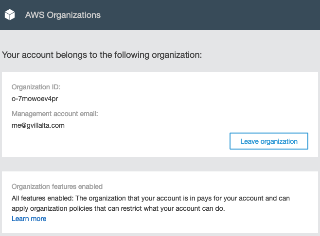

# Projeto - Configuração de Serviços em Cloud e Segurança

> Seleção de um provedor de serviços de Cloud e configuração de dois produtos e
> serviços de segurança (AWS, Microsoft Azure ou Gloogle Cloud Plataform - GCP)

Para este trabalho escolhemos a Amazon Web Services (AWS) como provedor de
serviços de nuvem. Iremos demonstrar a utilização de algumas ferramentas de
segurança desse provedor, como AWS IAM (Identity and Access Management), AWS WAF
(Web  Application Firewall), Amazon GuardDuty.

Além disso, criaremos alguns outros elementos da AWS para podermos usar nossa
aplicação.

## Arquitetura

O diagrama de arquitetura do projeto na AWS ficou da seguinte maneira:

Estamos seguindo seguindo uma [arquitetura de três
camadas](https://en.wikipedia.org/wiki/Multitier_architecture#Three-tier_architecture),
segregando com subnets as três camadas. Nas subnets públicas, fica apenas o
balanceador de carga (Load balancer, LB). Na subnet privada de aplicação, ficam
apenas as instâncias da nossa aplicação. Na subnet privada de bancos de dados,
ficam apenas as instâncias de banco de dados.

Vamos utilizar o AWS WAF com algumas regras pré-configuradas pela AWS para
proteger o tráfego de dados para a nossa aplicação. Além disso, vamos habilitar
os logs de VPC Flow para a nossa VPC. Isso garante que todos todos os registros
de tráfego da camada 4 serão armazenados e, posteriormente, podem ser utilizados
pela outra ferramenta de segurança da AWS que iremos utiliziar, o GuardDuty.

Além desses componentes de redes, vamos também habilitar o AWS CloudTrails, que
gera logs de atividas na conta da AWS e os armazena para posteriormente serem
utilizados pelo GuardDuty.

## Metodologia

Faremos tudo isso utilizando ferramentas de infraestrutura como código, que
facilitam o gerenciamento dos recursos na nuvem e nos perminetem tratar a
infraestrutura de uma maneira mais uniforme, integrada ao fluxo de trabalho
comum aos programadores.

Para isso escolhemos o [terraform](https://www.terraform.io/) como ferramenta
de infraestrutura como código (IaC), e vamos executá-lo de duas formas, locamente
com o programa de linha de comando `terraform` e pelo [Terraform
Cloud](https://www.terraform.io/cloud) da Hashicorp (empresa por trás do
terraform). Escolhemos essas maneiras por simplicidade de instalação e de configuração e praticidade de utilização.

Por conta da facilidade de criar um ambiente com múltiplas contas na AWS,
utilizando o AWS Organizations, nós optamos por usá-lo, ao invés de criar a
infraestrutura na conta pessoal de algum dos membros do grupo. Dessa forma é
trivial apagar a conta e com isso não ter que se preocupar com a cobrança por
conta de algum recurso esquecido. Além da facilidade de integração de cobrança
das contas filhas com a conta pai, como no exemplo abaixo:

