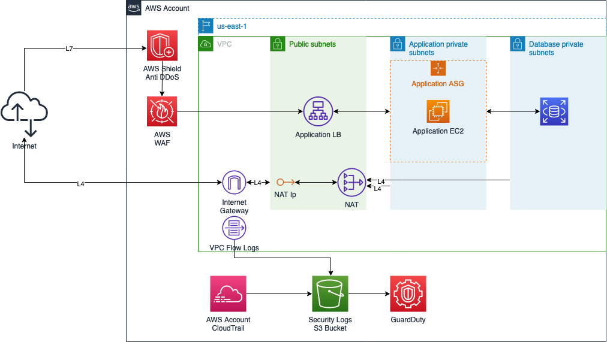

# Projeto - Configuração de Serviços em Cloud e Segurança

> Seleção de um provedor de serviços de Cloud e configuração de dois produtos e
> serviços de segurança (AWS, Microsoft Azure ou Gloogle Cloud Plataform - GCP)

Para este trabalho escolhemos a Amazon Web Services (AWS) como provedor de
serviços de nuvem. Iremos demonstrar a utilização de algumas ferramentas de
segurança desse provedor, como AWS IAM (Identity and Access Management), AWS WAF
(Web  Application Firewall), Amazon GuardDuty.

Além disso, criaremos alguns outros elementos da AWS para podermos usar nossa
aplicação.

## Arquitetura

O diagrama de arquitetura do projeto na AWS ficou da seguinte maneira:

Estamos seguindo seguindo uma [arquitetura de três
camadas](https://en.wikipedia.org/wiki/Multitier_architecture#Three-tier_architecture),
segregando com subnets as três camadas. Nas subnets públicas, fica apenas o
balanceador de carga (Load balancer, LB). Na subnet privada de aplicação, ficam
apenas as instâncias da nossa aplicação. Na subnet privada de bancos de dados,
ficam apenas as instâncias de banco de dados.

